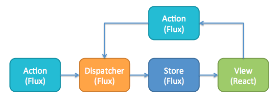

    

Flux es una arquitectura creada por Facebook para el manejo del flujo de datos de una aplicación, la cual **propone una arquitectura en la que el flujo de datos es unidireccional, los datos viajan desde la vista por medio de acciones, y llagan al store desde el cual se actualizará la vista nuevamente**. A diferencia del patrón MVC y/o MVVC donde el flujo de datos es bidireccional.

**Flux**

    

**MVC**

    

[http://facebook.github.io/flux](http://facebook.github.io/flux)

---

Sigamos con [Vista, Acciones, Dispatcher y Store](../2-flux/2-2-vista-acciones-dispatcher-store.md)
