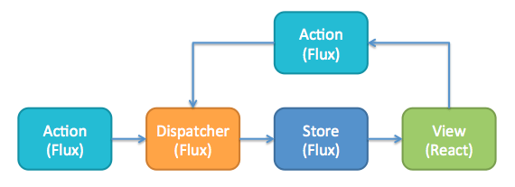

# Vista, Acciones, Dispatcher y Store

Al gual que el patrón MVC tenemos un Modelo, una Vista y un Controlador, en Flux encontramos los siguientes actores:

- **Vista**: Son los componentes de la aplicación, comprende todos los elementos visuales de cara al usuario.

- **Acciones**: Es un objeto el cual indican una intención de hacer algo (ejemplo: agregar, eliminar, borrar, etc.) y lleva todos los datos necesarios en caso de ser requeridos.

- **Dispatcher**: Propaga las acciones al Store, las cuales son procesadas en orden de llegada. Es un mediados entre las acciones y el store. En flus tenemos un único Dispatcher.

- **Store**: Podríamos compararlo con el Modelo del patrón MVC ya que es el encargado de guardar los datos ó mejor dicho "El estado" de la aplicación. Cabe resaltar que en Flux podemos tener varios Stores.

    

---

Sigamos con [Implementaciones de Flux](../2-flux/2-3-implementaciones-flux.md)