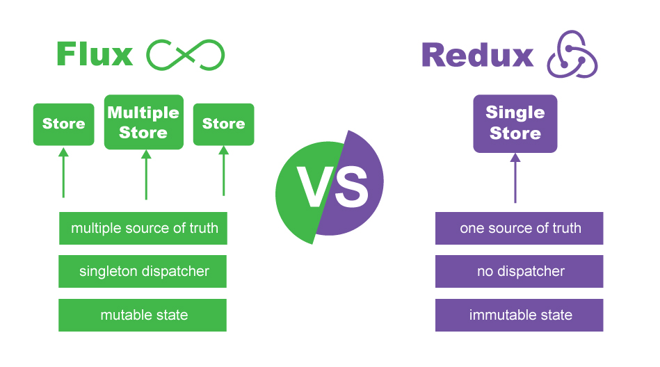
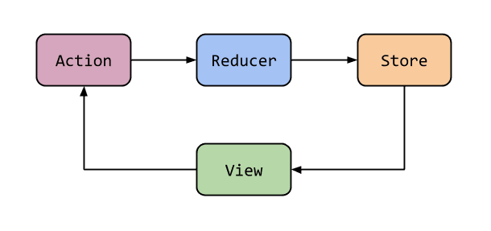

# Arquitectura Redux

Recordemos que Flux es un patrón de diseño y Redux es una librería que implementa Flux, por lo cual su arquitectura o esquema de trabajo es muy similar, salvo con ciertas modificaciones que detallamos a continuación.

    

- **Un solo Store:** A diferencia de Flux, Redux simplifica la gestión del estado con un único Store.

- **No hay Dispatcher:** Tal vez la característica más notoria a simple vista dentro de su modelo arquitectónico, es que en Redux no tenemos Dispatcher, debido a que solo tenemos un único Store (un único destino) para las acciones, eliminando la necesidad del Dispatcher.

- **Estado Inmutable:**  En Redux hablamos de Reducers en lugar de Dispatcher. **Los Reducers son funciones puras los cuales aceptan el estado y una acción como argumentos**, y generan una nueva **COPIA** del estado anterior con las modificaciones. La palabra **COPIA** es importante ya que **Redux considera que el estado es inmutable**.

    

---

Sigamos con [Principios de Redux](../3-redux/3-3-principios-redux.md)
