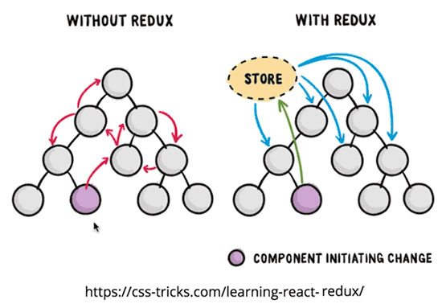

# ¿Por qué Redux?

**Redux nos permite desacoplar el estado global de nuestra aplicación web de la parte visual**, haciendo que la información viaje desde la vista hacia el store de manera unidireccional. Esta gestión de estado se logra debido a que Redux está basado en Flux, salvo con ciertas modificaciones claves las cuales veremos a continuación:

    ...

    

---

Sigamos con [Actions, Reduces y Store](../3-redux/3-3-actions-reducers-store.md)
