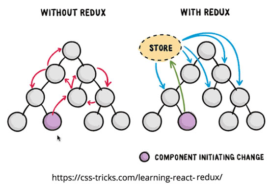

# ¿Por qué Redux?

**Redux nos permite desacoplar el estado global de nuestra aplicación web de la parte visual**, haciendo que la información viaje desde la vista hacia el store de manera unidireccional. Esta gestión de estado se logra debido a que Redux está basado en Flux:

    

Es **importante aclarar** que con Redux no estamos diciendo que las demás implementaciones de patrones sean malas, todo lo contrario, cada escenario tiene múltiples formas de resolver un problema. No obstante cuando nuestra aplicación comienza a crecer mucho y se nos dificulta la comunicación entre componentes, Redux es una poderosa herramienta que nos ayudará a solucionar este problema.

A continuación describiremos algunos escenario que nos darán una pista de cuando implementarlo.

---

Sigamos con [¿Necesito Redux?](../3-redux/3-5-necesito-redux.md)
