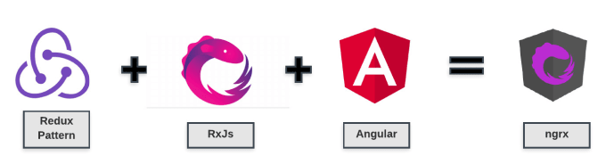

    

NgRx es el estándar por defecto para implementar Redux en Angular, es un framework para construirplicaciones reactivas.

Los patrones de Redux + RxJS + Angular 2 en adelante dan vida a NgRx.

    

[https://ngrx.io](https://ngrx.io)

---

Sigamos con [Arquitectura NgRx](../4-ngrx/4-2-arquitectura-ngrx.md)
