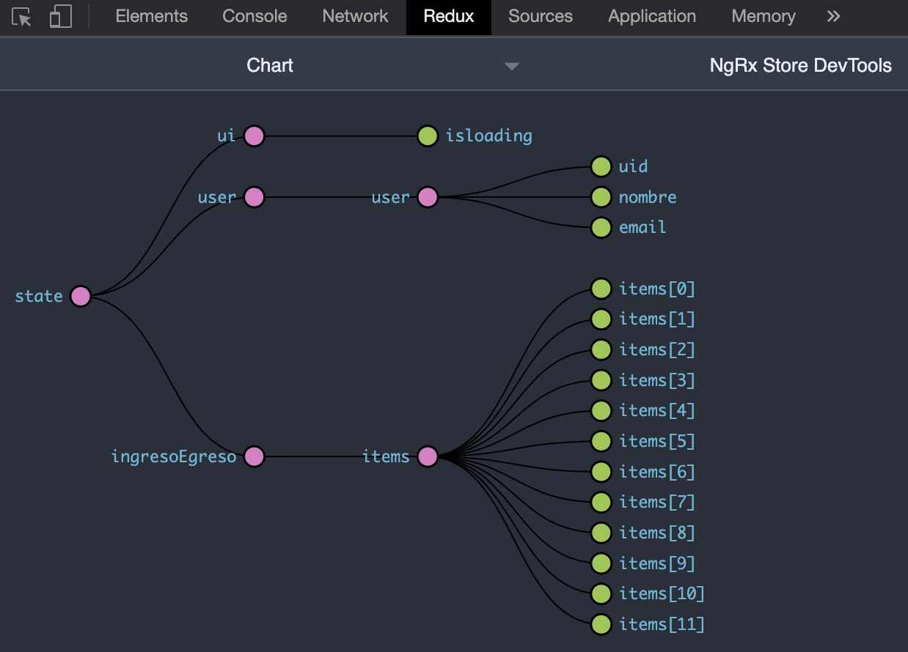

# Store Devtools

El Store Devtools, es una poderoso instrumento que nos provee herramientas para el manejo y gestion del Store de nuestra aplicación. Entre algunos de sus usos encontramos:

- Hacer debugging de nuestro estado.
- Volver y Regresar a un punto del estado en particular.
- Exportar e Importar el estado.
- Visualizar como el estado reacciona a las acciones emitidas por el usuario.

    

[https://ngrx.io/guide/store-devtools](https://ngrx.io/guide/store-devtools)

---

[Ir al inicio](https://github.com/jreategui07/workshop-redux-angular-ngrx)
